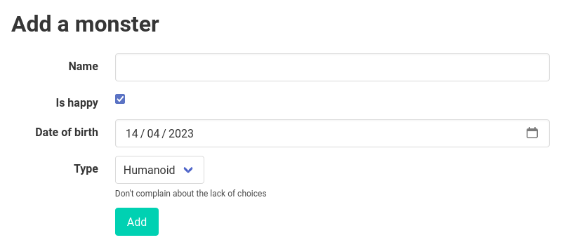
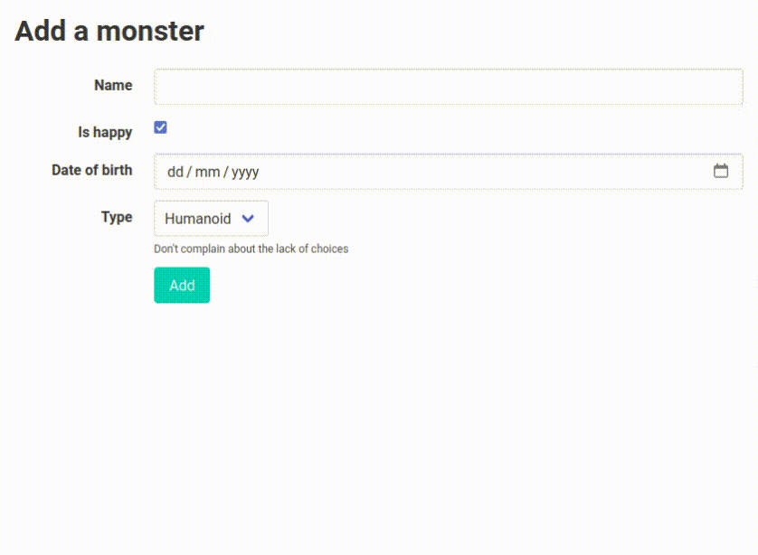

Form validation
===============

Django has an awesome `form <https://docs.djangoproject.com/en/stable/topics/forms/>`_ abstraction that allows us to define all the input handling, validation and HTML in a single place, so that rendering a complete form can be as simple as:

.. code-block:: html+django

   <form method="POST" action=".">
     {{ form }}
     <button type="submit">Submit</button>
   </form>

Plus we can make the form a `ModelForm <https://docs.djangoproject.com/en/stable/topics/forms/modelforms/>`_ so that we can re-use our model definition to create a form automatically, with constraints etc. respected.

But now we want some htmx goodness, so that either:

- the submit button will do a server call without leaving the page, updating the form inline

- or, as the user is filling out the form, we validate each field they change one by one, so that they don’t have to wait until the end to see problems with the form.

The first of these is fairly standard htmx that you can do with the techniques
shown already; the second has more moving parts, and is what this page deals
with.

In addition, we want this to work in the real world, which means that we may need to significantly change the HTML of a form to match our custom design or what our CSS framework/library expects the HTML to look like.

But we don’t want to give up anything Django has given us! No compromise on UX **or** DX!

So let’s go!

.. contents::

But first…
----------

Actually before we start, ask yourself “Do I really need this?”. HTML5 already provides lots of `form validation features <https://developer.mozilla.org/en-US/docs/Learn/Forms/Form_validation>`_. In Django you can emit these attributes by:

- using `Field <https://docs.djangoproject.com/en/stable/ref/forms/fields/>`_ arguments like ``required`` to set the HTML ``required`` attribute.
- choosing the right `widget <https://docs.djangoproject.com/en/stable/ref/forms/widgets/>`_ (or a custom widget),
- or using `Widget.attrs <https://docs.djangoproject.com/en/stable/ref/forms/widgets/#django.forms.Widget.attrs>`_ to set things like the HTML ``pattern`` attribute.

If you can lean on HTML, do so!

Trickiness
----------

In addition, getting field/form handling correct can be very tricky, especially regarding things like focus that are not explicitly represented anywhere in the DOM. Here are some requirements:

- We must never overwrite what the user has inputted with some earlier state or blank state (obvious, but easy to get wrong)
- We mustn’t interrupt the user or start showing validation errors while they are still entering data, that’s really annoying. If we do provide feedback while typing, we must be doubly careful not to change the entered data or focus in any way.
- Since we are trying to provide early feedback, we need to do so as soon as the user is “finished” with a field. But detecting that is hard, and it’s different for different field types e.g. as soon as they have toggled a checkbox they may expect feedback, even though the focus is still on the control.
- We mustn’t break keyboard navigation (via tab), change the way focus works, or change keyboard manipulation of controls (e.g. space to toggle a checkbox, space/arrow keys/typing to change a select).
- We need to handle weird cases relating to focus like checkboxes which can be changed by clicking on their ``<label>``, which may not leave the focus on the checkbox.
- We must work correctly for mobile, where keyboard input is quite different.
- We must do all of the above correctly for all browsers, being sensitive to the fact that they may not send DOM events in exactly the same way.

**Earlier versions of these docs had subtle bugs with all the above!**

**And this version still has potential bugs!**

Specifically, I’ve found that the ``delay:50ms`` technique can be sensitive to timing. ``delay:1ms`` is not enough on some computers, so this isn’t robust.

If you need to provide early feedback, there may be better alternatives, like splitting up a long form into multiple parts that are checked individually.

But if you are still determined, read on.

Form HTML and styling
---------------------

Rather than focus on just the htmx/Django techniques, I’m doing a fuller example, partly because real-world concerns often affect the solution. In particular, styling of a form normally affects the HTML, and that affects how we can break it up in order to update fragments via htmx, so you actually need to start with styling and form layout. If you just want the htmx details, skip down to the `htmx it! <htmx_it_>`_ section.

I’ll include some of the main things you’ll need on this page, with some brief notes for the techniques used. For full details the code is available in the `code folder <./code/>`_ as always.

For styling this demo, I chose to use `Bulma <https://bulma.io/>`_ as an example of a popular, real world CSS framework that has a decent story regarding form layout – but one I haven’t actually used before, to make this a more realistic exercise! Our aim is that we’ll be able to do the template/styling work once, and re-use it for all forms in our project. For a different CSS framework, most of what is written here should apply.

Bulma
~~~~~

First, we grab the Bulma CSS and add it somewhere in our repo’s static files:

.. code-block:: shell

   curl https://cdn.jsdelivr.net/npm/bulma@0.9.4/css/bulma.css > my_app/static/vendor/bulma.scss

(We could also get a minimised version, or get the Sass source files, but we don’t actually need them for this example).

Note that I’ve saved the CSS file to an SCSS extension, which will be useful later.

Django/Python deps
~~~~~~~~~~~~~~~~~~

I’m going to use Sass to help with CSS, and the easiest way to do that in Django, avoiding the use of nodejs and other things, is to use libsass, is which pip-installable via `libsass-python <https://github.com/sass/libsass-python>`_. We can use it from Django by installing `django-libsass <https://github.com/torchbox/django-libsass>`_ and using `django-compressor <https://django-compressor.readthedocs.io/en/latest/>`_. For help rendering forms, we’ll also use `django-widget-tweaks <https://github.com/jazzband/django-widget-tweaks>`_.

.. code-block:: shell

   pip install django-compressor django-libsass django-widget-tweaks

We now have have a few tweaks to make to our settings:

.. code-block:: python

   INSTALLED_APPS = [
       ...
       "django.forms",
       "compressor",
       "widget_tweaks",
   ]
   STATICFILES_FINDERS = (
       "django.contrib.staticfiles.finders.FileSystemFinder",
       "django.contrib.staticfiles.finders.AppDirectoriesFinder",
       # other finders..
       "compressor.finders.CompressorFinder",
   )
   STATIC_ROOT = BASE_DIR / "_static"

   COMPRESS_ENABLED = True
   COMPRESS_PRECOMPILERS = [("text/x-scss", "django_libsass.SassCompiler")]

Base templates
~~~~~~~~~~~~~~

We need something like this now in our ``base.html``:

.. code-block:: html

   
   
   <!DOCTYPE html>
   <html lang="en">
     <head>
       
         <link rel="stylesheet" type="text/x-scss" href="">

       

Our ``base_bulma.scss`` starts something like this:

.. code-block:: scss

   @import "../vendor/bulma.scss";

   // Our styles here …
   body {
       padding: 1rem;
   }
   // …

Form renderer
~~~~~~~~~~~~~

Next, we need some custom form templates. This is needed not just to apply our custom HTML/CSS stuff, but also to be able to do rendering of the form on a field-by-field basis, which we’ll need later.

In this example I’m going to isolate changes so that they only affect the forms we want, rather than all forms, so I’m going to do it with a custom form renderer:

.. code-block:: python

   from django.forms.renderers import TemplatesSetting

   class BulmaFormRenderer(TemplatesSetting):
       form_template_name = "forms/bulma/div.html"

We are using our own form templates, to minimize disruption to other forms. You could instead override the provided ``django/forms/*.html`` templates by adding templates with those names to your own templates directories, but that will affect all forms.

We then create a form mixin that specifies this renderer, plus some other small tweaks:

.. code-block:: python

   class BulmaFormMixin:
       default_renderer = BulmaFormRenderer()

       def __init__(self, *args, **kwargs) -> None:
           # We don’t want ':' as a label suffix:
           return super().__init__(*args, label_suffix="", **kwargs)

We can then use this in a form like:

.. code-block:: python

   class CreateMonsterForm(BulmaFormMixin, Form):
      ...

Form templates
~~~~~~~~~~~~~~

We can use the builtin `django/forms/div.html <https://github.com/django/django/blob/main/django/forms/templates/django/forms/div.html>`_ template as a starting point for our main form template. We need to make a bunch of changes to fit the HTML to what `Bulma expects <https://bulma.io/documentation/form/>`_. So far it looks like this:

.. code-block:: html+django

   
   {{ errors }}
   
     
{{ field }}

   
   
     <div class="field is-horizontal {{ classes }}">
       
         

           {{ field.label_tag }}
         

       
       

         
           

             

               
                 

                   {{ field }}
                 

               
                 {{ field|add_class:error_class }}
               
             

             
               
{{ field.help_text|safe }}

             
             
               

                 {{ errors }}
               

             
           

         
       

       
         {{ field }}
       
     

   
   
     {{ field }}
   

Later on we are going to pull out the body of this into a partial.

There is a `bit of SCSS <./code/htmx_patterns/static/css/base_bulma.scss>`_ we’ve added to support this.

I won’t go over all of the above in detail, but here are some of the things we’ve used:

- We’re using the ``widget_type`` template filter from django-widget-tweaks to be able to render different HTML for different types of widgets – in this case, an extra ``
`` is needed for ``<select>`` elements.

- We’re using the ``add_class`` template filter, again from django-widget-tweaks, to be able to customise the HTML for widgets for the case of adding a class to mark errors (in this case applying an ``is-danger`` class).

- For some other CSS/HTML needs, I’ve gone for a different technique. Normally, for `Bulma styled inputs <https://bulma.io/documentation/form/input/>`_ and `checkboxes <https://bulma.io/documentation/form/checkbox/>`_ etc., you need HTML like ``<input type="text" class="input">`` and  ``<input type="checkbox" class="checkbox">`` etc. This is tedious to specify in a template, but with Sass we have a different technique available, based on the `@extend <https://sass-lang.com/documentation/at-rules/extend>`_ rule. We can write rules like this:

  .. code-block:: scss

     @import "../vendor/bulma.scss";

     .field-body {
         input[type=text], input[type=email], input[type=password], input[type=date] {
             @extend .input;
         }
         input[type=checkbox] {
             @extend .checkbox;
         }
     }

  This basically means “treat all ``input[type=text]`` elements inside a ``.field-body`` element as if it had the ``.input`` class applied” etc. Sass does a bunch of magic to make this work, including applying related rules like ``.input:focus``.

  A neat thing about this technique is that it works even if our CSS library doesn’t provide Sass source – here we just renamed the CSS to SCSS and ``@import`` -ed it. If you have Sass source available, providing mixins and variables etc, you can have more control, and also produce smaller HTML.

  This same technique is used to add styling to the ErrorList object displayed as ``{{ errors }}`` at the top of the form, without having to override the HTML rendering or duplicate CSS.

- We can control some of the HTML by adding tweaks at the widget level defined in the form e.g. to make our date input render as ``<input type="date">`` instead of ``type="text"`` we do something like:

  .. code-block:: python

     class CreateMonsterForm(ModelForm):
         class Meta:
             fields = [..., "date_of_birth"]
             widgets = {
                 "date_of_birth": DateInput(attrs={"type": "date"}),
             }

  or:

  .. code-block:: python

     class CreateMonsterForm(ModelForm):
         date_of_birth = DateField(widget=DateInput(attrs={"type": "date"}))

  You can also added ``class`` attributes as part of ``attrs`` if you want, but I think that’s not so neat as keeping that in the template.

Form view
~~~~~~~~~

With all that in place, we can write a very simple standard form view:

.. code-block:: python

   def create_monster(request):
       if request.method == "POST":
           form = CreateMonsterForm(request.POST)
           if form.is_valid():
               monster = form.save()
               messages.info(request, f"Monster {monster.name} created. You can make another.")
               return redirect(".")
       else:
           form = CreateMonsterForm()
       return TemplateResponse(request, "create_monster.html", {"form": form})

And the template achieves our aim of being able to do just ``{{ form }}`` for rendering:

.. code-block:: html+django

  <h1 class="title">Add a monster</h1>
  <form method="POST" action=".">
    

    
      
There were some problems with your input:

    
    {{ form }}

    

      

      

      

        <button class="is-primary" type="submit">Add</button>
      

    

  </form>

Result:

.. _htmx_it:

htmx it!
--------

Now at last we’ve got the starting point where we want to apply htmx. We want this behaviour:

- we shouldn’t display any validation errors initially
- we should trigger server-side validation after a user leaves a field, but only for that field, not for the rest of the form.
- we should avoid validation that relate to multiple fields, since that is likely to be confusing when the user is part way through.
- we mustn’t do things like repeatedly upload files when triggering validation.

Add deps
~~~~~~~~

As well as the htmx dependency, in this case we’re going to need the `htmx idiomorph extension <https://github.com/bigskysoftware/idiomorph/#htmx>`_. After downloading add the ``<script>`` tag to a relevant base template.

Extract a partial
~~~~~~~~~~~~~~~~~

We start by pulling out a partial from our ``forms/bulma/div.html`` template, so that we can easily render a single row of the form. We can call this ``forms/bulma/field_row.html``.

Add the htmx attributes
~~~~~~~~~~~~~~~~~~~~~~~

We then need to add an ID to the outer ``
`` in this partial so that we can easily target it for htmx requests, and we need to add htmx attributes. We’re going to add them conditionally so that we can disable this behaviour easily if we need to. Our ``field_row.html`` template now starts like this:

.. code-block:: html+django

   

     {# etc #}
   

In addition, we need to add ``|attr:"hx-preserve:true"`` to the two usages of ``{{ field }}``. The “control” div now looks like this:

.. code-block:: html+django

        

          
            

              {{ field|attr:"hx-preserve:true" }}
            

          
            {{ field|add_class:error_class|attr:"hx-preserve:true" }}
          
        

To break all that down:

- We’ve added an ID we can target
- We’re going to add the htmx stuff only if:

  - the flag is true
  - and if we’re not doing a file upload widget (which would not end well with files being repeatedly uploaded)
  - and if we’re not doing a checkbox. Due to the way that clicking a label triggers a change event and a focusout event, I haven’t found a way of enabling validation of checkboxes that doesn’t break in some way (see the “trickiness” section above). However, validating checkboxes is usually not useful, especially since we are validating only one field at a time. If you have a checkbox that must be ticked, use the `required attribute <https://developer.mozilla.org/en-US/docs/Web/HTML/Attributes/required>`_.

- We’re doing a GET to avoid the possibility of our form being submitted i.e. we are retrieving form validation errors, not submitting a change.
- We’re making a request to the same URL (we’ll fix up the view code shortly).
- We’re adding a special input ``_validate_field`` which tells the server which field to validate.
- We want this htmx request to be triggered on any field change from the div we’re in. For some inputs, like ``<input type="date">``, the ``change`` event will fire when the user is still typing, and we will trigger validation far too early. We want to avoid interrupting the user while they are still entering data, especially if displaying validation errors will make the page move. So we wait until the user has finished with the field, indicated by the ``focusout`` event (like the ``blur`` event, but it bubbles, which is what we need).
  - We add a delay of 50ms to give the value of the control time to update. The ``focusout`` event happens before the ``change`` event, so in some cases you can see the earlier value of the control without this. It might be that 50ms is not enough on some machines, **so this is not robust**.
- In the request GET data, we want to include data only from the current field (there is no point sending and processing other fields, especially not file uploads etc.)
- We want to swap out the current div with the new one returned by the server.

  - But, we want to ensure that we don’t change any of the actual input widgets, to avoid the possibility of overwriting user data with a response from the server. **This is important** since there is a real possibility of this happening — for example if some responses from the server took a long time to arrive and so were applied after the user had made further changes to a field. So we add the `hx-preserve attribute <https://htmx.org/attributes/hx-preserve/>`_ to implement this, using the ``attr`` filter from ``django-widget-tweaks``.
  - In addition we’ve enabled the ``idiomorph`` extension, and used the ``morph:outerHTML`` method. This is the best available method for merging in changes without disturbing the DOM, and it can make a difference in cases like this.

The use of ``hx-preserve`` is not compatible with some other htmx usages where you do want to overwrite fields with server provided data. See `hx-preserve docs <https://htmx.org/attributes/hx-preserve/>`_.

Fix up the form renderer and mixin
~~~~~~~~~~~~~~~~~~~~~~~~~~~~~~~~~~

To avoid mixing logic from different layers later, we’ll define template names as attributes on the form renderer. So we now need to add this:

.. code-block:: python

   class BulmaFormRenderer(TemplatesSetting):
       ...
       single_field_row_template = "forms/bulma/field_row.html"

   class BulmaFormMixin:
       ...
       do_htmx_validation = False

       def get_context(self, *args, **kwargs):
           return super().get_context(*args, **kwargs) | {
               "do_htmx_validation": self.do_htmx_validation,
               "single_field_row_template": self.renderer.single_field_row_template,
            }

(I just made up the names ``single_field_row_template`` and ``do_htmx_validation``, you can choose something else).

``do_htmx_validation`` defaults to ``False`` so that it is opt in, because we will also need to add logic to each view to make it work — we don’t want forms pointlessly sending validation requests that never get answered. So we’ll also need:

.. code-block:: python

   class CreateMonsterForm:
       do_htmx_validation = True

And the main loop in ``forms/bulma/div.html`` becomes:

.. code-block:: html+django

   
      
      
        {{ field }}
      
   

Add the view logic
~~~~~~~~~~~~~~~~~~

We now need to change the view function to handle this validation case:

- we should **not** attempt to save the form!
- we should instead do validation, and render a single row of the form (with any errors), and return that.

We can implement this as a decorator we can add to the view:

.. code-block:: python

   @htmx_form_validate(form_class=CreateMonsterForm)
   def create_monster(request):
       ...

I’m doing this:

- so we can avoid creating a new URL just for the validation, and avoid having to pass that URL into the form – we can just use ``hx-get="."`` as above.
- so we can avoid complicating the view with the details
- to have a very easy way of adding this to other views.

This decorator method has the downside that we have to repeat the form class again outside the view body, but sometimes this can be useful – I have cases where I need the form used for validation to be slightly different from the real one.

The ``htmx_form_validate`` function looks like this:

.. code-block:: python

   def htmx_form_validate(*, form_class: type):
       """
       Instead of a normal view, just do htmx validation using the given form class,
       for a single field and return the single div that needs to be replaced.
       Normally the form class will be the same class used in the view body.
       """

       def decorator(view_func):
           @wraps(view_func)
           def wrapper(request, *args, **kwargs):
               if (
                   request.method == "GET"
                   and "Hx-Request" in request.headers
                   and (htmx_validation_field := request.GET.get("_validate_field", None))
               ):
                   form = form_class(request.GET)
                   form.is_valid()  # trigger validation
                   return HttpResponse(render_single_field_row(form, htmx_validation_field))
               return view_func(request, *args, **kwargs)

           return wrapper

       return decorator

It simply checks for an htmx request, then pulls out the ``_validate_field`` parameter to decide which field to render and return.

The ``render_single_field_row`` utility is pretty simple – see the `full code for the details <./code/htmx_patterns/form_utils.py>`_

That’s it we’re done – the validation will trigger as soon as a field is changed, and display server-side validation in the form:

Code
----

- `view <./code/htmx_patterns/views/forms.py>`__
- `decorator <./code/htmx_patterns/form_utils.py>`__
- `form renderer <./code/htmx_patterns/form_renderers.py>`__
- `page template <./code/htmx_patterns/templates/form_validation.html>`__
- `form main template <./code/htmx_patterns/templates/forms/bulma/div.html>`__
- `form field row template <./code/htmx_patterns/templates/forms/bulma/field_row.html>`__
- `CSS <./code/htmx_patterns/static/css/base_bulma.scss>`__
- You can also see the changes needed just for the htmx part `here <https://github.com/spookylukey/django-htmx-patterns/commit/dce54298c68dc0a52fe465578d78256dd8df9faf>`_

Tips
----

* Make your form renderer inherit from TemplateSettings, not DjangoTemplates, to get TEMPLATES customisations, and also to get reloading of templates to work with dev server, which seems not to happen for DjangoTemplates
